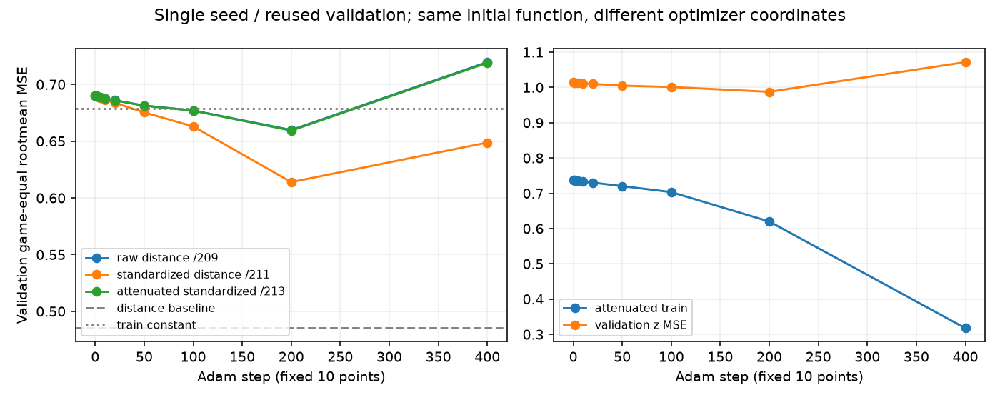

# 距離列の更新増幅を抑える1対照 / quoridor-4lc.213

固定200stepのvalidation gameMSEは **0.6593288242**。標準化のみの211（0.6139164436）に対して **+0.0454123807**、24局中20局で悪化、4局で改善した。原raw209は0.6598473195であり、211の利益は今回の減衰介入で大半が失われた。更新増幅の関与に整合するが、中心化のbias結合と以後の勾配・Adam moment軌跡も異なるため、尺度又はstepを唯一原因とする裁定ではない。距離基準0.4851468131を超えず、棋力・独立test・候補昇格の根拠はない。

train96/4653行、validation24/1248行、同mask10b502cd、seed19080311、同400step batch SHA83eb87b8、H32/12193parameter全FT/h/out学習、Adam LR1e-4/WD0/batch128を211から維持した。train-only gameweighted populationvarianceによるmu/sigmaと補償済initial tensor51b9a8c0を再用し、初期5901行のraw関数parityはmaxabs2.2351741791e-8（上限1e-6）だった。test行はloaderのlabel-free container読取後にjoin/model/統計/witnessより前に除外し、旧standalone testlabels/results/raw等は読んでいない。

唯一の介入は各Adam proposal後、hidden最後2距離列をbefore+proposal*sigmaへf32で置換したこと。Adam moment・bias・他parameterはproposalのままで、paramgroup再初期化はない。before/Adamproposal/理想sigma倍/実applied f32deltaを保存した。初回proposal0の2要素はunknown ratioとして保存し、丸めzeroをfaultにしない。最大applied−理想delta差1.80535e-10は事前f32丸めbound以内だった。初回実raw距離delta normは0.0007873849827、211の0.01457859296に対する比0.0540097。raw=実applied/sigma、rawbias=実dbprime−sum(実applied*mu/sigma)を用い、厳密ratio一致は要求していない。

10固定点0/1/2/5/10/20/50/100/200/400の全曲線と全24局paired、phase/z/sign/saturationを保存した。200step train gameMSEは0.6198396697、validation z gameMSE0.9874485127、z sign accuracy0.5392628205、saturation0。400step validationは0.7190460651で、secondary bestは200step。固定12train witnessのstep0からの予測変化RMSは200stepで0.1696590693（211は0.2122204310）。validation再用・単seedという限界を保持する。

CPU2/torch1/GPU0の1科学jobは2026-10-04T05:21:54.352397Zから壁時計3.074941秒、exit0、peakfamilyRSS786186240B、PID4036964/tick34428044、全子wait・currentexact不在。sample116111=train51200+eval59010+rawparity5901、warm0/newteacher/test/game0。開始前admissionにgoal/本人owner/no pause/foreignheavy無し/自然supervisor ownedNone/次予定05:28:50.912819ZとRAM/保存forecastを保存した。全host/全期間不在は保証していない。

管理NN0保存の初回は旧211 report whitelistによるassertionで失敗し、科学0のまま自域helperを修復して別attemptを保持した。科学成功の補充・再学習はしていない。保存helperはin-memory subtree Gitを用いdefault/private indexを使用しない。学習checkpointは標準化座標のweightsであり、scale.jsonと組にして使用し、rawinitialの補償を再度適用しない。3checkpoint archive/memberSHAと必要Git bytesを確認する。

次の最大1案は、この固定raw/標準化/減衰の対照を別jointseedで小さく再現し、単seedの更新依存と区別すること。今回の新test/追加条件/学習は自動開始しない。

データ: research-data/ai-sigma/frame15-distance-update-control/。source freeze: 71e197295fe002667711136b2782d96ceda7df7e。result.json、curves.csv、primary24-game-paired.json、initial-function-parity.json、first-proposal-finite.json、raw-coordinate-update-summary.json、science-stop.json、jobs/の全attempt、weights-manifest.jsonを参照。

