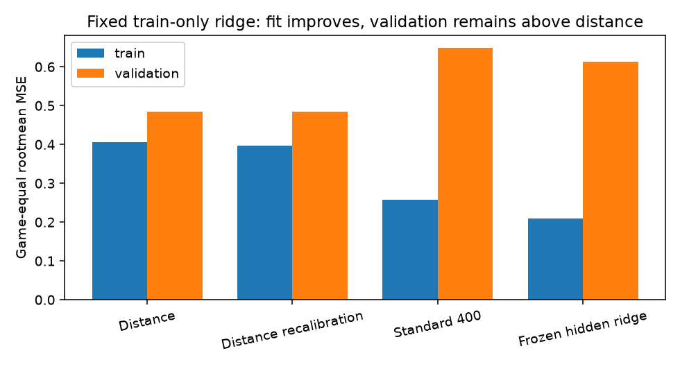
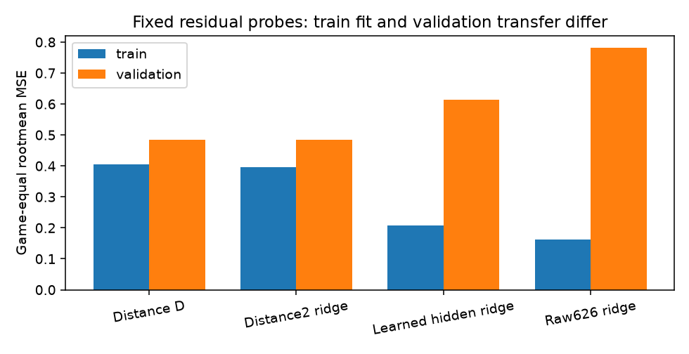

# 距離基準対NNの適合差と凍結hidden残差ridge / quoridor-4lc.216

同じtrain96game/4653行、validation24game/1248行・rootmean STM・game等重みで比較した。early200ではNNがtrainでも距離基準に届かず、400ではtrain適合は改善したがvalidationへ移らなかった。凍結standard400のhidden32に固定ridgeをfitしても、validationで距離基準を超えなかった。独立test・棋力・唯一の原因の判定は行わない。

## phase1: 同じ対象での比較

| checkpoint | train gameMSE | validation gameMSE |
|---|---:|---:|
| 距離D | .405943737 | .485146813 |
| plain200 | .620557346 | .659847319 |
| plain400 | .318324856 | .719676881 |
| standard200 | .548566856 | .613916444 |
| standard400 | .257283205 | .648771505 |

4checkpoint×5901=23604 CPU forwardを一度実行。保存aggregateとの最大差2.94e-10、有限対応PASS。standard400の残差相関はtrain .6073、validation .0479。validationのgap .163624692はdisplacement .192934292からalignment 2×.014654800を引いた値。各排他的binの原rowweight `1/(G*n_game)` によるsigned寄与は全体へ1e-12以内で戻る。群内条件平均だけで主要原因群を選ばない。walls_total/binsはself+opponentの**remaining stock**であり、placed wallsや盤面複雑さではない。late群0行も保持。217によるphase1独立NN0算術PASS、phase2の効果は未独立。

## phase2: learned-feature residual ridge

checkpoint standard400 SHA `8f95a44c235fb151693e89632f844aab3c3b901327dfafa0f8a085a5642f2c75` を凍結。model.out pre-hookでpost-ReLU hidden32を同5901forwardから取得し、元予測とのmaxabs=0。重み不変。train-only gameequal population mean/stdでhiddenを標準化し、ゼロ分散列3はZ=0。lambda .01、intercept非penaltyの33係数閉形式solve。normal residual maxabs1.11e-16、condition number2388.47。f64 solve係数をf32へ変換し、f32 `residual=intercept+Z@beta; prediction=clamp(D+residual,-1,1)` で評価した。optimizer/backward0。

218採択のs=opp-selfによる2係数残差ridgeはNN0のtrain-only参照。通知受領時には主scienceが終了していたため、主版を保持し、結果metric本文を読む前に別prospective amendment-v2を固定した。追加forward0、lambda変更/valfit/sweep0。

| 固定候補 | train gameMSE | validation gameMSE |
|---|---:|---:|
| 距離D | .405943737 | .485146813 |
| 距離2係数再校正 | .396295079 | .484539758 |
| standard400 | .257283205 | .648771505 |
| learned-hidden ridge | .208593662 | .612798685 |

ridgeはDに対しtrain84/96game改善・12悪化、validation11/24改善・13悪化。validation gap .127651872、残差相関 .0387、振幅RMS .3852。trainの情報/fitは確認できるが、この表現と固定readoutによる残差転移は不足する。元head変更とDanchoring・線形化・ridgeが同時に変わるため、旧headだけを原因としない。距離参照の微小利益も再用validationの探索観測であり独立性能の認定ではない。

unclipped ridge rootmean gameMSEはtrain .230820012、val .630601948、clippedは上表。clip行は878/4653と130/1248。真zのgameMSEはridge train .461690524/val .978340013、D .683917256/.822535032。validation z/signの改善をrootmean精度や棋力と混同しない。rowMSE・z/sign・全group/pergame・signed寄与はcompact分析に保存。

## 実費・停止・再現

phase1 CPU2/Torch1 06:17:08.275826–06:17:09.786933、wall1.515544s/peak familyRSS613748736B。phase2 06:30:50.041884–06:30:53.336964、wall3.299503s/peak640339968B、exit0/全wait/currentexact不在。合計29505/30000 samples、heavy4.815048/180秒、warm/GPU/学習/test/教師/対局0。NN0解析・plot・Git管理は別。test行はlabel-free全144containerからlabeljoin/model/moments前に除外し、旧standalone testlabels/results/raw/journal/正式173は未読。

source/preregister、checkpoint/input SHA、guardian command/owner/PIDtick/当時ownedNone+quiet/currentRSSは各job admissionに保存。主科学源・結果・旧phase1停止版を上書きせずphase2専用subdirへ保存。`hidden_features.npz`、係数、matched perrow、compressed fullgroup分析は再用可能。科学source/子停止後Git必要byte復元/defaultindex不変/Beadsbackupを引渡す。瞬間全host不在/未来quiet/独立test/棋力は保証しない。

再現入口は `tools/ai-sigma-fit-gap-analysis/forward.py` と `residual-head-control/forward_fit.py`。NN0参照は `distance_reference.py`、分解は `analyze-comparison.py`。再生成を自動開始する許可ではない。旧科学/source/preregisterと結果後解釈は別版保持。

次最大1案はgame-group cross-fit residual headの低費用対照。今回のreadout fitの安定性と表現の残差転移不足を判別する材料とし、history/教師/分布/他readoutの競合説明を保つ。新配分前の自動train/test/forwardは行わない。

## phase3: raw QF1加法的probe

learned hiddenの低容量readoutで残差転移が不足したため、元state入力の加法的関係を一つの固定NN0対照で検査した。actualSTM順binary312×2とdistance2の626列、train-only gameweighted population mu/std、zero列β0、lambda .01/intercept非penaltyの627係数。行列はRAMのみ。distance2だけの3係数も結果前固定し、phase2のs差2係数とは別参照とした。容量/penalty geometryはhidden32と異なる。

| 固定probe | train gameMSE | val gameMSE |
|---|---:|---:|
| distance2残差ridge | .396228716 | .484525910 |
| raw626残差ridge | .161373671 | .781449457 |

raw626はtrain80/96game改善・16悪化、val10/24改善・14悪化。val gap .296302644、rNN RMS .547699、eDとの相関 .004809。unclipped train .177281775/val .832536159。36zero分散列はβ0、train未観測でval activeの列/行massは0。normal residual8.33e-17、condition785.50。原重みbin寄与は全体gapへ戻る。真z/sign/rowMSEと全群はraw-linear-control/residual-analysis.json.gzに保存し、rootmean誤差へ代用しない。

この固定raw加法的probeでもtrain補正がvalidationに転移しない。raw特徴全無効/teacher/history/分布の唯一原因とは判断しない。distance2微小利益も全非線形距離の影響を除外せず、binary壁/pawn独自関係の証明にはならない。cross-fit headはencoderが全trainで学習済みのためconditional readout varianceのみという留保で保留。

初回jobはscript parseの閉じ括弧不足で0.053226秒失敗、matrix/solve0/NN0。失敗source/preregister/logを保持し、構文のみのv2で1成功math0.895876秒/peak255750144B<448MiB、全wait/currentexact不在。実開始/終了・owner/currentquiet/CPU2/BLAS1はjobs/raw-ridge-r2に保存。元static180秒内の保守的prior課金120秒+今回全attempt0.949103秒、追加forward0/totalNN29505不変。新teacher/game/test/モデル/optimizer/backward/GPU0。

217のphase2独立算術PASSを後受領した。係数差5.72e-14、予測差2.384e-7、scalarもPASS。結果前参照のowner非読取宣言は独立検証の対象外。phase3は本人自己検証のみ。次最大1案は後続配分でstandard200hiddenを同D/ridge.01へ接続しrepresentationの学習時点を400と比較する。新encoder学習やraw幅拡張・λsweep・fresh testを自動開始しない。

同row/gameの全6候補比較はraw-linear-control/matched-all-models.csvに保存（原phase2集計を再用）。

## phase4: train-game whole-pipeline CVでの正則化

raw626のλ=.01では大きいfit-transfer gapがあったため、元train96だけで5gamefoldを固定した。6opening cohortごとに16gameをSHA256(`frame16-216-CV-v1` + NUL + UID)で並べindex%5へ割当。foldは24/18/18/18/18game。各foldのfit側だけで距離WLS、raw列population moments、zero分散処理、残差ridgeをfit。encoderは教師学習済みNNを使わずraw state入力であり、whole-pipelineでheld labelを避けた。全96game平均でOOFを集計し、fold単純平均を使わない。

| λ（固定3点） | OOF gameMSE |
|---|---:|
| .01 | .493742890 |
| 1 | .382828357 |
| 100 | .405647536 |
| fold-train-only距離基準 | .408041381 |

OOF最小・1e-10同値なら大λという結果前規則でλ=1を選択した。端点ではない。validationはfold/moments/係数fit/λ選択に不使用。選択後に全train96へ一度fitした距離WLSは既199係数差a1.39e-17/b1.78e-15、f32 D出力maxabs0で対応した。

| fulltrain固定候補 | train gameMSE | 固定val gameMSE |
|---|---:|---:|
| λ=.01 raw（既phase3） | .161373671 | .781449457 |
| CV選択λ=1 raw | .215836922 | .548893455 |
| D | .405943737 | .485146813 |
| distance2再校正 | .396228716 | .484525910 |

選択後の固定valは11/24game改善・13悪化（対D）。unclipped train .221499040/val .557235205、clip408/4653・75/1248行。val z gameMSE .893439133対D .822535032、z符号game等重み .640769263。val rootmean gap .063746642はdisplacement .101033191−2×alignment .018643274へ分解され、原gameweightの全排他的bin signed寄与は全体へ戻る。

強い正則化はOOFと固定valをλ=.01より改善し、低正則化の分散/effective game数の関与に整合する。ただし固定valではD未達、OOF→val差も大きい。分布/coverage/teacher/history/CV varianceと非線形関係は残る。OOFや再用valを独立testとしない。λの再選択・追加値・新teacher/test/学習/forwardを行わない。

219の指摘を結果後label-free補助として受け、shared canonical APIによるstate OR history OR actual STM f32 input露出を記録した。foldfit→held4653行とtrain96→val1248行とも共有0/mass0。分母/fold/mask/λを変更しない。216側この診断は06:57job終了後、統括の「219が補助実施・216追加不要」通知より前に約.14秒で既実行していたため、その時系列とsourceを保存し、以後追加算術を行わない。共有0は全非線形入力support/独立分布の保証ではない。

実mathは06:57:39.665747–06:57:42.129273、CPU2/BLAS1 wall2.463894秒/peak265625600B<448MiB、exit0/全wait/currentexact不在。source preflight0.041899秒は保守的5秒課金（preflightのaffinityログは未保持、主mathはCPU2固定）。元static最新130.949103+preflight5+math2.463894+露出補助保守1=139.412996/180秒。Git/report/圧縮保存管理は別。NN actual29505不変、新NN/model/optimizer/backward/GPU/game/test0。

結果payloadはXZへlossless圧縮し、archive-manifestに元uncompressed scientific SHA/復元PASSと元gzip wrapper SHAの来歴を残した。gzip wrapper byte同一は主張せず、必要JSON/JSONL payloadはexact復元済み。科学sourceは当時gzip出力版のまま凍結、正本は各XZとmanifest。source/input/result/currentPIDtick停止bindingはscience-source-stop-receipt.jsonを219/coordinatorへpack前に実配送した。旧phase1/2/3の正本は変更しない。phase4独立219の裁定は別、現在owner自己検証結果。

次最大1案は既保存frozen400hidden32を固定λ=1で再読出しするNN0対照。rawのCVで示唆された正則化をlearned表示へ適用し、元λ=.01からの残差転移を検査できる。raw626とhidden32ではpenalty geometryが異なるので最適λの移植や唯一原因としない。standard200 age案は有力保留、新現在配分前に実行しない。
