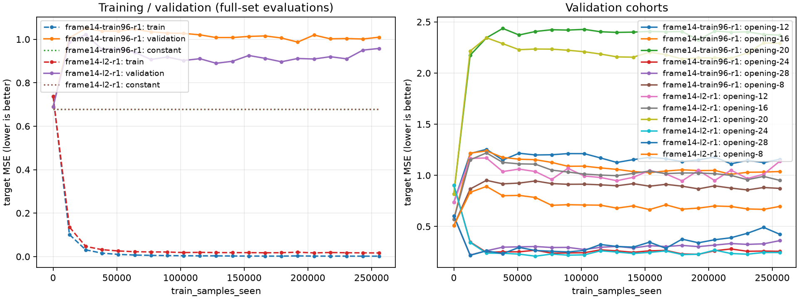

# frame14 QF1 L2単因子対照 / quoridor-4lc.197

**L2は最終validation誤差と飽和を減らしたが、採用条件を満たさず、不採用。新testは全24 NOT_STARTED・評価0。** 固定valの最良checkpointは依然step0（未学習）で、初期モデルとtrain定数の双方を1e-4以上下回るgateは未達だった。閾値・candidateを変えず、追加学習/testを開始していない。

## 195との境界・固定条件

195は科学/source/doc/子停止、Git971ec0d1/必要byte復元/9weightsSHA/backup、統括有限受入れを経て本人close。197だけをclaimし2026-10-04T00:34:03.083363Zに新scopeの静的準備を開始した。旧195source/doc/候補/全成功失敗/旧testはreadonly。197の選別へ旧test/labelsを読み直していない。受領のAPI配送時計は未採取、最初の後続tool観測00:31:42.382450Zを保存し、絶対newheavy01:15/science01:20/process01:30/submit01:40をresetしていない。

元final-qf1-v2の96train4653/固定24val1248/同max96 mask、同初期tensorSHA `e5d218c9750d581eab7ca6a114acaa8f3cf5bd24474e3f639280705271fc7ddb`、freshseed19080311、QF1-H32/rootmean target/gameequal sampling/AdamLR.001/2000step×128を維持。**optimizer.weight_decayだけ0→.01**（AdamのL2、AdamWではない）。resource limits.samplesは新課題cap500000に下げたが、両runは2000stepまで完了し制限で打切られていない。WD0は195train96-r1の保存全21曲線/初期/BEST/LASTを再用し再学習0。共有tools/nnue-trainingを編集せず、private管理scriptだけを新自域へ置いた。

全train/val/game/cohort/phase/rootmean/z/符号/飽和/定数をstep0と100..2000で保存。同initial SHAと固定validation SHA/manifestの一致を確認。train256000samples・評価123921、計379921 / cap500000。weights_only CPUでinitial/best/lastのSHAを確認した管理処理の追加forwardは0。

## 曲線の比較とgate

| 条件 | 最終train rootmean gameMSE | 最終val rootmean game / rowMSE | 最終val z gameMSE | val z符号 row率 | val飽和 row率 |
| --- | --- | --- | --- | --- | --- |
| WD0保存対照 | .0017817 | 1.009580 / .976988 | 1.408749 | 54.33% | 29.57% |
| Adam WD.01 | .0166144 | .957841 / .928205 | 1.333015 | 51.12% | 7.21% |

L2はtrain fitを弱め、最終val rootmean/z MSEと飽和を下げた一方、z符号row率は低下した。WD0の最良positive stepは1500/.986999、L2は1000/.889589で、どちらもstep0の.690176やtrain定数.678780を超えたまま。正則化に反応する観測はあるが、未見gameへの有効な学習転移は支持しない。

結果前の4条件（beststep>0、initialと異なる重み、WD0bestとtrain-only定数を各1e-4以上改善）はすべてfalse。beststep0/valgameMSE.6901755738627967、bestweightSHAはinitialと同じ。[固定gate結果](../../research-data/ai-sigma/frame14-l2-control/gate-result.json)を統括と198ownerへ実配送した。24新test枠を全NOT_STARTEDとして保存し、生成/評価0・補充0。1e-4は数値微差による無駄な起動を避ける値で、統計支持や棋力の判定ではない。

[全21時点のtrain/val CSV](../../research-data/ai-sigma/frame14-l2-control/curves/all-metrics.csv)、[z曲線](../../research-data/ai-sigma/frame14-l2-control/curves/z.png)、[各game/phaseと保存値だけの比較](../../research-data/ai-sigma/frame14-l2-control/saved-curve-analysis.json)を保持。WD0は既保存の点を読み、旧科学結果を置換していない。最終valの24game paired区間はpost-result探索的算術であり、gate/閾値の変更や新独立testの代わりには使わない。1248行を独立標本とは扱わない。

## 費用・source・停止

CPU2単logical/torch intra-inter1/RAM2GiB guard1879048192Bで直前current owner/RAM/scheduler/保存をadmit。L2 science実開始00:37:09.256875Z、終了00:37:15.746723Z、**jobwall6.490182s/peak family RSS798793728B/379921samples/GPU0/warm0**。exit0、全子wait、remaining0、current exact PID-starttick不在を即報告。管理のNN0/plot/Git/backupは科学と別に記録。GPU/CUDA/ORT/ONNX/export/arena/新教師/依存更新は本人0。

[結果前preregister](../../research-data/ai-sigma/frame14-l2-control/preregister.json)にreadonly sourcehash・元dataset/mask/config/seed/target/採否を固定。source Gitは[Git-source-before-science.json](../../research-data/ai-sigma/frame14-l2-control/Git-source-before-science.json)。private launcherは既manager関数をメモリ上で197のscope/ownershipへ結び、別のhard120/累積heavy300/static600/sample500000と保存guardを適用した。共有source/defaultindex/環境の編集0、privateindex0。全失敗/欠測を隠さず、本科学は一度だけ成功し再学習0。

新scope16MiB/guard14MiBは旧195の既64MiB予約の実未使用から配分。旧195 current+uniqueGit+残metadataと新16MiBを先に計上し32,790,602B<既combinedguard58,720,256Bを確認。旧role未確認量を減額せず親追加0。全checkpointはmodels/experiments/nnue/frame14-l2-r1に保持し、gate-resultのpath/file SHA/tensor SHA/lenで参照。必要Gitbyte復元、実保持+残forecast、source/子停止、Beadsbackupの最終receiptで引き渡す。元成功出力へ同commandを再実行しない。

## 次の最大1静的判別（提案・未実行）

A=高epochでgame対応を記憶する正則化不足、B=表現/history/STM view又はK64 rootmean対応が未見gameへ移らない可能性を保持。今回のL2量ではAを解決できなかったが、Bや容量不足を確定する根拠にもならない。

train/validationだけからopening-ply6群×STM P1/P2の12witnessをlabel/loss非依存で固定し、別算術でraw state→P2回転/所属交換→実QF1 STM入力の対応とteacher/root最終統計の視点・field bindingをNN0で独立auditする案。terminal winner→STM zも確認する。rootmean真値や探索品質をNN0で認定しない。同shared関数をoracleとcheckerの両方にして自己照合にしない。誤対応なら旧科学を保存した最小修正の新配分、PASSならこの範囲の系統誤差を制約しhistory欠落/容量/noise/分布差は残す。

CPU2/static60s/RAM512MiBguard448/保存128KiB案。必要archive memberをstreamし全raw複製0、旧testlabels/model/forward/train/GPU/game/build0。詳細は[next-static-proposal](../../research-data/ai-sigma/frame14-l2-control/next-static-proposal.md)。現在197で追加起動せず、同L2量やLRのsweep、αβ/対局、全T1実装へ自動拡張しない。
