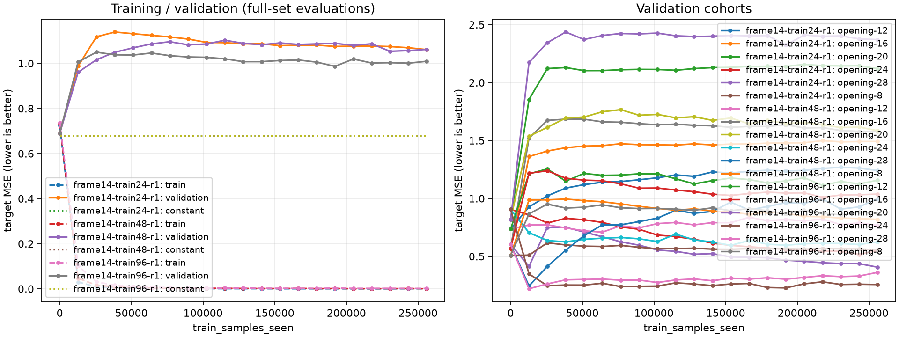

# frame14 QF1学習曲線・候補freeze・独立test一巡 / quoridor-4lc.195

**学習・選定・独立testの機能接続は完了したが、今回の学習候補は不採用。** 全24/48/96game段階のvalidation最良stepは0で、選定候補は未学習重みと同じだった。独立testでも定数予測以下。固定学習samplesでの96 LAST対24 LASTの効果は不確かで、データ増量の利益を認定しない。NNUEの最終容量・最高棋力・Sigma非劣性は未認定。

## 固定した条件と封印

frame14明示許可内。受領2026-10-03T23:30:36Z、本人claim/静的開始23:31:07。194全科学/owned子回収後、本人直前admissionからCPU2単logical・torch intra/inter1・RAM2GiB/guard1.75GiBで実行した。GPU/新教師/ONNX/arena/依存取得は195では0。

新144familyの96train/24validation/24testを結果前に固定。194の **final-qf1-v2** のtrain4653/validation1248/test1095行を使い、partial版を最大96へ読み替えていない。初期seed19080311・QF1二視点312+STM順距離2・transform32/hidden32/dropout0、Adam LR.001/weight_decay0、rootmean target、gameequal sampling、2000step×128=256000学習samples、100step間隔の全train/validation評価、patience0。各段階は同初期重みから新規学習であり、継続学習ではない。

canonicalな実forward入力（STM/相手順sorted IDs+同順float32距離bits+version）を署名に使い、state **OR** history文脈 **OR** 実QF1入力の共有を露出とした。validationは最大train96、testは最大train96+全validationに対する固定mask。今回val1248/test1095行はすべてeligible、全24test gameの除外/eligible0gameは0。これは固定署名集合との一致が無かったという結果で、パターン・分布・履歴表現全体の独立性を保証しない。正式173holdoutは使用していない。

testラベルは候補freeze前に195が読まず、label-free metadataとsealed path/SHAだけを扱った。候補freezeと結果前固定LAST比較を束縛後、排他的test-open-onceを作成して一度だけ開封。testはtrain/選定/earlystopへ戻していない。全人/全host未閲覧の保証はしない。

## 曲線と候補

| train game / rows | 学習samples / epoch相当 | 最終train rootmean gameMSE | 最終val rootmean gameMSE | best step |
| --- | --- | --- | --- | --- |
| 24 / 1217 | 256000 / 210.35 | .0006524 | 1.061326 | 0 |
| 48 / 2345 | 256000 / 109.17 | .0007272 | 1.062104 | 0 |
| 96 / 4653 | 256000 / 55.02 | .0017817 | 1.009580 | 0 |

学習前val gameMSEは約.690176、train定数valは約.67875–.67878。最初の100stepからvalが悪化し、学習がtrainをfitできる一方、固定未学習gameへの転移を支持しなかった。容量不足、表現/view誤差、教師noise、正則化不足をこのgapから一意に決めない。

事前の「val gameMSE最小、同点はstage順→早いstep」に従い48game step0を候補freezeした。段階間の初期score差は約1e-11で、同じtensorSHAにもかかわらず全評価のbatch文脈が違うことによる微小数値差と整合する。48gameの学習優位とは扱わない。全段階初期tensorSHAは `e5d218c9750d581eab7ca6a114acaa8f3cf5bd24474e3f639280705271fc7ddb`。

全21時点/各game/6opening cohort/early-middle-late/rootmean・z・符号・飽和は各run historyに保持。[全曲線CSV](../../research-data/ai-sigma/frame14-learning/curves/full-metrics.csv)、[z曲線](../../research-data/ai-sigma/frame14-learning/curves/z.png)、[train first24/追加24/追加48の前後集計](../../research-data/ai-sigma/frame14-learning/train-prefix-cohorts.json)も保存。旧190/192曲線に途中点を追加していない。

## 一度だけの独立test

最終freeze SHA `45c27fbf896f7c205b393253fa89a39736fe5ef1805c4c9f7c9dfafd463dd84d`。candidate/initial/24LAST/96LASTとtrain-only定数を同じ評価で比較。実ロードしたcandidateとinitialの重みSHAが一致したため予測を再利用し、4checkpointファイルに対して**実3unique重み/3285samples/warm0**。24test game/1095rowを全保存した。primary=secondaryは今回露出除外0のため。

| 役割 | rootmean MSE game / row | z MSE game / row | z符号一致 row | 飽和row |
| --- | --- | --- | --- | --- |
| 候補＝未学習 | .669736 / .670040 | 1.015371 / 1.016662 | 49.22% | 0% |
| train定数 (.01113469) | .655448 / .654650 | .999704 / .999778 | 50.78% | 0% |
| 24 LAST | .905718 / 1.015988 | 1.274734 / 1.406780 | 54.89% | 27.03% |
| 96 LAST | .948741 / .979400 | 1.260083 / 1.276052 | 57.44% | 19.45% |

候補−initialは同重みで0。候補−定数のgame rootmean差+.014288、paired game bootstrap探索的95%区間[+.009425,+.019899]。候補は未学習であり学習効果0、定数以下だった。重み採用・native棋力評価への自動移行はしない。

結果前固定LAST96−24のgame rootmean差+.043023（区間[-.163854,+.251313]）、z差−.014651（[-.316620,+.299666]）、game等重みz符号差−.014805（[-.138604,+.092983]）。rootmean改善gameは12/24。row重みでは96のrootmean/zが小さく、符号row率も大きいが、game重みとは向きが異なる。都合の良い重み付けを選ばず、増量効果は不確かと判断する。

bootstrapは24game/familyをpairedで再標本化（2000回/seed19580311）。1095行を独立標本と呼ばず、6opening cohort各4gameの小標本とgame内相関を保持。根拠は[test全結果・各game/cohort](../../research-data/ai-sigma/frame14-learning/test-r1/result.json)、[ID付きper-row scalar gzip](../../research-data/ai-sigma/frame14-learning/test-r1/per-row.jsonl.gz)。rootmeanはK64 MCTS蒸留値でありminimax真値ではない。真zとの誤差/符号は別診断で、MSEから棋力を認定しない。

## 費用・版・失敗・停止

3学習とtestのheavy jobwall合計 **17.674083s**（5.437654/4.629732/5.466612/2.140085）。学習+全集合評価samples1019139、test3285、計 **1022424 / cap5000000**。peak family RSS857710592B/guard1879048192B、GPU0。全4job exit0/childwait/remaining0/current exact PID-starttick不在、最後の科学停止00:19:28.877661Z。各jobのadmission/owned/processに直前owner・scheduler・RAM・保存・source commandを残した。登録したNN0/static helper費と未計測短管理の限界は[cost-ledger](../../research-data/ai-sigma/frame14-learning/cost-ledger.json)へ分離する。

194の24→96増分生成train02/03/04 jobwallは **344.849375s**、全144生成691.356145s。既保存export helper2.058943/3.321377/2.896601s、pack.964100s、Git99.002331s/restore1.309020s等は生成jobwallと別。旧helper失敗の未計測上界や準備・報告calendar wallを隠さず、全pipelineの完全計測速度とは呼ばない。195の受領→test科学終了calendarは2932.877661s（待機/LLM/source準備を含む）。新生成の効果を学習速度だけに付け替えない。

学習source Git `ca8f5fd20e9358067ddcc3cb6837618d137ddd6e`、test weight-reuse修正source Git `49b29570ab3640cca6ab1430e20f508c247afa40`。mask SHA `10b502cd9e1c5334e56a3f460ef3edff7f822c8f52f69c3af53529c67c45d5f5`、descriptor SHA `fd7e059296aeba1ada0a9f083e5dca61132ee2d90f5605181b7d727b5c2e7510`。旧interface-v2六sourceは保持。全checkpointはmodels/experiments/nnue/frame14-train{24,48,96}-r1に保存、[weights path/SHA/len](../../research-data/ai-sigma/frame14-learning/weights-manifest.json)で束縛。複製してGitへモデルを追加していない。

管理失敗はscienceと区別する。初期mockは194heavy/currentのため延期（NN0）、一度のreport body path誤りとmask.games.all KeyErrorは小管理修復。plot r1はtraining環境にmatplotlib無しでNN0失敗、既plot専用環境でr2成功、依存更新0。test前のweightSHA予測reuse修正は旧freezeを保存して新future v2へ束縛し、元3stage科学は変更0。成功scienceの補充・置換・新LR学習・再testは0。

再現入口はrun/process command/config/stage manifestを参照する。元成功run/test outputへは再実行しない。将来明示配分で再現する際もsealed testを条件選択へ戻さず、新run/outputと予算を別にする。Gitのbyte復元/保存実量/backup/最終書込停止は最終receiptを参照。

## 次の最大1案（未実行）

候補Aは高epoch反復でgame固有対応を記憶する正則化不足、候補Bはhistoryを含まない表現/STM view又はK64 targetの不安定性による未見対応の不一致。fit成功だけでBを否定せず、両者が共存する余地を残す。

同96train/同固定val/同初期重み/AdamLR.001/2000step×128のまま、**weight_decayだけ0→.01**にした1runを提案する。元96-r1を対照reuse、全曲線・game・符号・飽和を保存、追加LR/sweep0。val改善なら正則化への感度を支持し、無改善ならこの正則化量の支持を留保して表現/view・教師の独立audit等の次配分を考える。原因保証はしない。

CPU2/120s hard・最大379921samples/RAM2guard1.75、参考実学習約5s。新未使用testは別entropy fresh24family/6opening-ply均衡の1batchを結果前宣言、train96+全val+開封済旧testのlabel-free署名に対する固定露出maskを使う。新candidate/初期/定数をfreeze後に一度評価（例えば評価cap12000samples/hard120sを別配分）。GPU生成はCPU3+host1/VRAM6/RAM6guard5.5/hard150s案、既24game102–123sは参考のみ。学習・生成・自然CPU0監督は物理非重複と回収余裕をadmitする。残費や生成不足なら不確かのまま提出し別test交換0。詳細は[提案](../../research-data/ai-sigma/frame14-learning/next-proposal.md)。これは追加実行許可ではなく、統括の新現在配分待ち。今回の旧test・候補選定へ戻さず、対局/全T1実装を自動開始しない。
