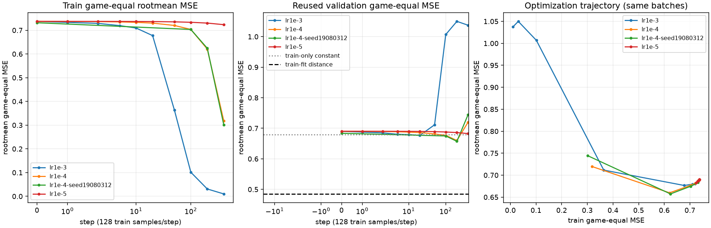

# QF1の学習率・早期曲線と局所入力感度 / quoridor-4lc.209

frame15、hypothesis。原受領2026-10-04 04:02:48.793798 UTC。CPU2一論理・Torch intra/inter1、float32/GPU0。既96train4653行、固定validation1248行/24game、最大96mask `10b502cd`。validationは条件選定で再用した探索用であり独立testではない。新教師・ゲーム・test・旧test再読・173正式holdout使用は0。

元100step刻みはLR.001のstep20での利益を見落としていた。今回の別runでは早期点を固定して観測した。LR.0001のstep200での平均改善は別seedでも同方向だったが、24gameの区間は0を跨ぎ、固定距離基準には及ばない。重み採用・原因一意判定・棋力認定は行わない。旧195などの曲線/BEST0は変更しない。

|条件|初期val gameMSE|探索的best step/MSE|step400 train/val gameMSE|
|---|---:|---:|---:|
|LR.001 seed19080311|.690175574|20 / .676581943|.010014409 / 1.037446670|
|LR.0001 seed19080311|.690175574|200 / .659847320|.318324856 / .719676881|
|LR.00001 seed19080311|.690175574|400 / .682640586|.723557650 / .682640586|
|LR.0001 seed19080312|.683589561|200 / .657331349|.301549381 / .744268429|

各400step×128、同gameequal/rootmean/Adam WD0・QF1-H32。最初3条件は同初期tensorSHA `e5d218c9...`、同400step batch-orderSHA `83eb87b8...`、評価点0/1/2/5/10/20/50/100/200/400。第三の低LRは到達train誤差が高く、400stepだけで無効とは判断できない。第四は統括04:23:26の新実配分でseed19080312・評価0/100/200/400、初期とsamplingのjoint変更を分離しない。新初期SHA `30dcbc64...`。

第四の結果前primaryは200−自seed0。−.026258212、24game paired bootstrap95%区間[−.063621105,+.010431312]（2000回、seed20980312）。元seedの同差−.030328254と並べる。第四200−train-only定数は−.021449118、区間[−.059486803,+.015171976]。固定train-fit距離基準.485146813との差は+.172184536、区間[+.062798709,+.294145096]。100/400とBESTはsecondaryであり、新test候補をここで変更しない。400stepは11.00365相当epoch、200は5.50183、20は.55018。

全層勾配の有限性に加え、critic210提案のactive FT列のupdate比、固定12train witnessのstep0からのRMS/最大変化・target残差・tanh前値/ReLU活性を既評価forward内で観測した。追加observer forward/backwardは0。初期各層勾配は非0、初期出力飽和0。FTの初回active284/312列のupdate比はLR.001/.0001/.00001で約.029/.0029/.00029であり全層normと別記した。LR.001の後半では訓練minibatchの飽和が増え、LR.0001では出力変化とtrain fitが進みつつvalが悪化した。観測minibatchのdead率を永久dead neuron率へ拡大しない。

標準Adamを維持し学習率だけをまず変えた。[PyTorch Adam](https://docs.pytorch.org/docs/stable/generated/torch.optim.Adam.html)と[ReLU](https://docs.pytorch.org/docs/stable/generated/torch.nn.ReLU.html)の定義を参照した。既.lr001の0/100/200/400 aggregate値は原saved曲線との差1e-12以内で一致し、今回のobserverによる同点の変化は見られない。

追加小sanityは統括の明示現在配分による1probeのみ。既seed LR.0001のinitial/BEST200/LAST400、同12固定train witness、疎特徴不変、distance(self,opponent)へ±(-1,+1)/160。108forward＋36 input-backward相当=144。重みを固定しtensor byte不変、基底予測は旧witnessとの差1e-6以内。方向有限差分RMSは初期.01717/BEST.14323/LAST.30554、正方向は10/12、12/12、12/12。距離入力は完全に無視されてはいない。ReLU crossingは3/3/0行、FD−analytic最大差.00369/.00197/.00000355。保存fieldの2b=16.55285は非clip線形参考値であり、各行のclip距離基準の傾きとは区別してNN0算術を別保存した。合成off-manifold入力であり合法position、教師品質、予測精度の証明ではない。

A=LR/早期更新・反復、B=活性/出力/入力利用、C=履歴不足/教師noise/分布差は競合として残る。早期改善と後半val悪化はAに整合し、全層が無更新・距離入力が完全に不使用という単純なBは観測と合わない。Cや特徴/容量の説明を排除しない。次の最大1案は、低LRのstep200を結果前freezeし、新しい独立24family testで距離基準/定数と一度比較する有限単位。追加fitやsweepの前に早期利益が未見gameへ移るかを判別する。目安はfresh24教師生成1job120s/同K64と露出mask、CPU評価1job120s/モデル2unique×最大2000row程度、GPU推論既6GiB内・学習0。これは提案であり今回起動していない。未支持なら距離基準を維持し入力表現と教師分布の小診断へ戻す。

実科学4学習+probe wall15.600525s、最大family RSS900583424B。学習405434＋probe144=実405578sample。NN0集計で累積330630をjob単体sampleとして渡した管理counter失敗を原receipt/exit1のまま保持する（model成功は不変）。その誤課金を減らさず保守guard736208/800000を用いた。第四及びprobeのcounterはそれぞれ74804/144で一致。Git保存argvのphaseラベル誤りは実保存commitと別binding receiptで記録し、科学版を後付け変更しない。一度probe admissionが自分の未回収Git managerで拒否されたが科学0のまま正規wait後に開始した。

原3成功・stop・archiveと第四/preregister/archive、probe版を分離保存した。全owned科学childはwait済/current exact identity無し。詳細は `research-data/ai-sigma/frame15-learning-diagnostic/` のpreregister、四条件CSV/全game圧縮曲線、observer/witness、four-condition-result、probe-result/算術、jobs/各process、checkpoint memberSHA/len/メモリ復元、final-science-stopとstorage/restore receipt。コードは自域thin AST reuse/instrumentのみで共有trainerを編集せず、private/defaultindex変更0。提出までに必要Git byte復元・Beads backupと書込停止を引き渡し、coordinator有限受入れ後closeする。

critic210の独立NN0裁定は全4曲線のgame/row差最大3.33e-16、第四primary同値/14 of24改善、同12witnessと74804sampleを確認した。probeはcriticの最終job停止後に到着したため独立未検算のまま区別する。全稿を保存gateにはしていない。
