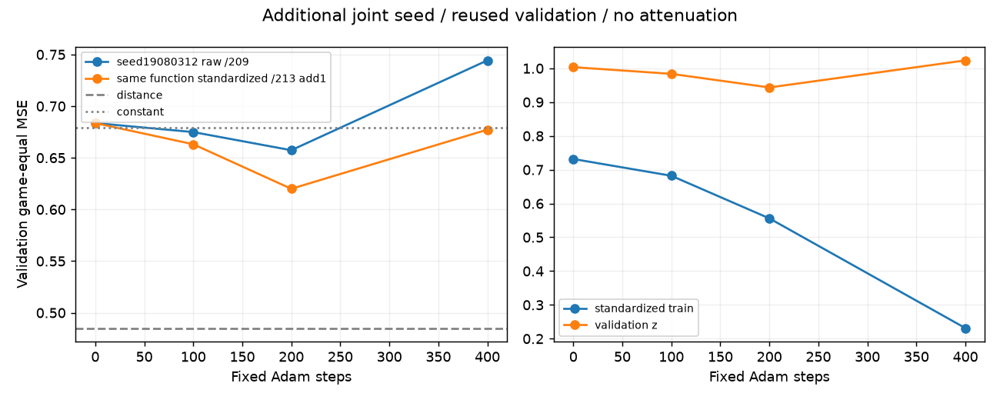

# 213追加1条件: jointseed19080312の標準化のみ

固定primary200は0.6199875632−既raw対照0.6573313493= **−0.0373437860**。全24validation game中18改善/6悪化。原seedの211と合わせ標準化利益を2jointseedで観測したが、距離基準.4851468131より誤差が大きい。新独立test/棋力/原因一意は未認定。原213減衰runを再実行・統合・置換していない。rowMSE差-0.0358383556/z gameMSE差-0.0350637848/sign差0.0600961538も保存した。

唯一の追加条件は211型標準化のみ、初期化とsamplingのjointseed19080312。raw30dcbc64checkpointの必要initial.pt memberのみを自域へ展開し、archive bytesとの一致を確認した。train-only mu/sigma・初期bias補償・全FT/h/out-H32/Adam1e-4WD0/batch128/400stepを保持、減衰hook無し。同rawseedのbatch81539be1対応、eval0/100/200/400だけ。初期5901raw関数parity max1.4901161194e-8<=1e-6、新scaledtensor40b9af3cで同tensorでなく同関数を保存した。test行はlabeljoin/モデル等より前に除外、旧standalone testlabels/results未読。

4固定点の曲線、200step全24paired/phase/cohort/row/z/sign/saturation、固定12train witness/updateの保存のみ。BESTはsecondary探索点で追加選択や新runへ使わない。jointseedの初期化とsamplingは別々の因果へ分離していない。標準化は情報/容量追加でなくoptimizer座標・raw distance update/biascouplingの介入である。

Actual05:32:22.186765Z、CPU2/torch1/GPU0/warm0、2.877428295秒、peakRSS894660608B、exit0/PID4046330/tick34490882/全wait/currentexact無し。追加80705=train51200+eval23604+rawparity5901、原116111と合算196816<=200000。累heavy5.952369321秒、原180秒内。自然ownedNone/次quietとowner/pause/foreignheavy/RAMをnewjobs/admissionへ保存した。元213receipt/source/result/stop/handoff/版の上書きは無し。

NN0preserve helperはstep1observerに追加scheduleのcoordinate項目がないKeyErrorで失敗し、未採取項目を除く薄schema修復後成功。元失敗版とtyped不足を保存し科学sample追加0。全observerのstep1record自体は残している。weights3archive/memberSHA復元、defaultindex不変のGit bytes確認後に引渡す。元8MiB予約に全old/new/current/Git/tempを計上し新予約0/未知減額0。

次最大1は、必要なら2jointseedで観測した標準化+低LRを次の独立test候補として結果前freezeする判断を統括へ渡すこと。今回追加teacher/test/学習は開始しない。追加seedはownerの探索的再現で214の独立算術枠をresetせず、未独立部分を明示する。

